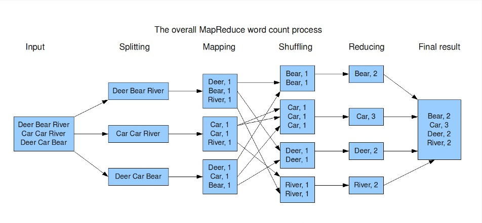
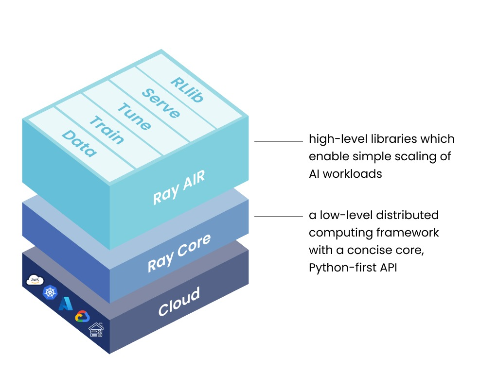
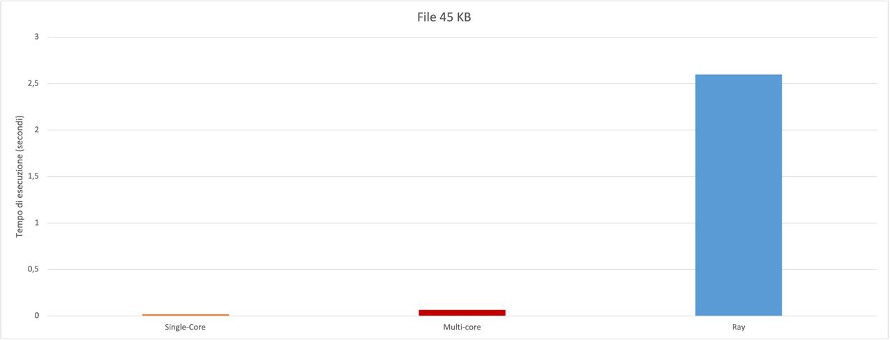
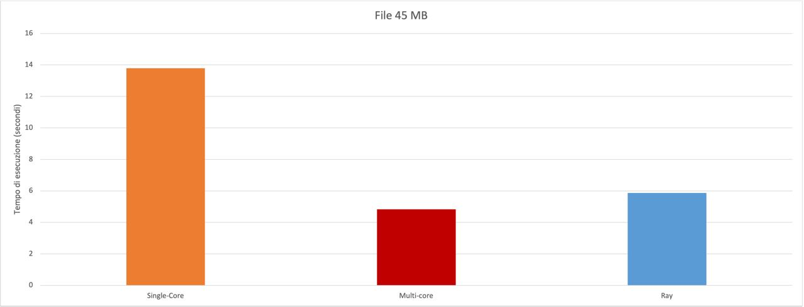
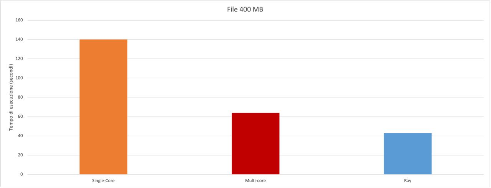
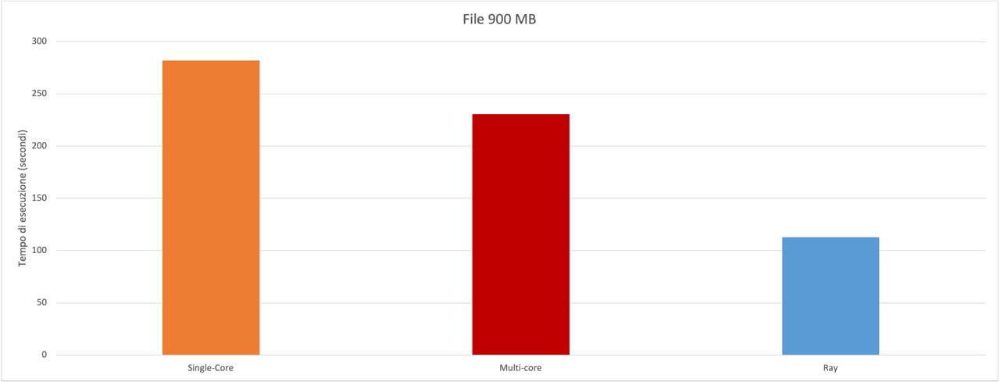

# Ray-Reduce
Implementation of the MapReduce algorithm with the Ray framework and comparison with the standard methods.

# Introduzione
L'evoluzione che Internet ha portato nelle vite quotidiane di addetti ai lavori e non ha cambiato drasticamente la maniera in cui le operazioni devono essere svolte: l'estrema quantità di dati immessa ogni giorno sulla rete necessita di prevedere una maniera accorta tramite la quale è possibile processarli non solo dal punto di vista algortmico, ma anche delle tecnologie e dei dispositivi utilizzati. Immaginare un sistema distribuito, composto potenzialmente da macchine etereogenee è la soluzione più conveniente e sostenibile attualmente per effettuare calcolo intensivo ed, inoltre, è anche l'approccio più adatto per un'evoluzione futura, dove avremo dispositivi sempre più piccoli, performanti e meno energivori.

# Tecnologie
## Map-Reduce
Map-Reduce fornisce un modello di programmazione che astrae il problema dalle letture e dalle scritture del disco, trasformandolo in un calcolo su insiemi di chiavi e valori.
Map-Reduce funziona suddividendo l'elaborazione in due fasi: la fase di mappatura e la fase di riduzione. Ogni fase ha coppie chiave-valore come input e output, i cui tipi possono essere scelti dal programmatore. Il programmatore specifica anche due o più funzioni: la funzione di mappatura e la funzione di riduzione.
MapReduce è un sistema di elaborazione batch e non è adatto per l'analisi interattiva, dunque l'ambito di utilizzo è per dati già consolidati e non per stream che cambiano continuamente. Il potere di MapReduce risiede nella sua capacità di scalare su computer, ciascuno con diversi core di processore, immaginando un cluster con più dispositivi.

<p align="center">
  
</p>

## Ray
Per realizzare il sistema distribuito, si è deciso di utilizzare il framework open source Ray, che utlizza il linguaggio Python per scalare calcoli di vario tipo, come ad esempio molti di modelli di AI. La sua peculiarità vincente è proprio il fatto di utilizzare Python: ciò lo rende fruibile su dispositivi di svariate prestazioni e architetture. Ray si pone come layer trasparente di distribuzione, in maniera che lo sviluppatore non si debba preoccupare di coordinare i dispositivi del cluster e distribuire in maniera equa il carico di lavoro. Esso gestisce autonomamente orchestrazione, scheduling e autoscaling e ha ottime politiche di fault tolerance.

<p align="center">
  
</p>

# Implementazioni
Per valutare vantaggi e/o svantaggi derivanti dall’utilizzo dell’algoritmo Map-Reduce, utilizzato in maniera distribuita tramite il framework Ray, sono stati effettuati una serie di test, in particolare:
si è deciso di contare le occorrenze di una specifica parola in quattro file di dimensioni via via crescenti, iniziando da uno di pochi Kb sino ad arrivare a file della dimensione di quasi un Gb. Per ognuno di essi, è stato provato l'algoritmo realizzata in maniera Monothread, Multithread e distrubuita. Il cluster utilizzato nel sistema distribuito è composto da 9 macchine, dalle modeste prestazioni nel quale gira il sistema operativo Ubuntu 22.04. Di segutio, i codici.

## Monothread
Il flusso di funzionamento del codice è il seguente: viene letto il file ed immagazzinato, diviso in tante parti quante sono le cpu. Successivamente ogni batch (ovvero una porzione del testo) viene dato in input alla funzione map di Python, che per ogni elemento del batch esegue la funzione data come parametro (in questo caso ```chunk_mapper```). La routine di ```chunk_mapper``` è quella di fare il map per la funzione ```mapper```, il cui compito è fare un map, questa volta per ogni singola parola, dapprima per rimuovere eventuali segni di punteggiatura (funzione ```clean_word```) e, successivamente, per verificare se si tratta della parola cercata (funzione ```matches_word```). Se effettivamente è la parola cercata, viene aggiornato il contatore. Emtrambe le funzioni reduce servono per mettere insieme i risultati dei vari contatori.

```python
import multiprocessing
from multiprocessing import Pool
from functools import reduce
from collections import Counter
from more_itertools import batched
import string
import time
import argparse

parser = argparse.ArgumentParser()
parser.add_argument("-w","--word")
parser.add_argument("-fn","--filename")
args = parser.parse_args()

def clean_word(word):
    return word.translate(str.maketrans('', '', string.punctuation)).lower()
def matches_word(word):
    if word == (args.word).lower():
        return word
def mapper(text):
    tokens_in_text = text.split(' ')
    tokens_in_text = map(clean_word, tokens_in_text)
    tokens_in_text=map(matches_word, tokens_in_text)
    return Counter(tokens_in_text)
def reducer(cnt1, cnt2):
    cnt1.update(cnt2)
    return cnt1
def chunk_mapper(chunk):
    mapped = map(mapper, chunk)
    reduced = reduce(reducer, mapped)
    return reduced
with open(args.filename, "r") as dataf:
    data=dataf.read()

data=data.split(' ')
data_chunks = batched(data,multiprocessing.cpu_count())

mapped = map(chunk_mapper, data_chunks)

reduced = reduce(reducer, mapped)

print (reduced)
```

## Multithread
Il flusso di funzionamento è il medesimo: la differenza sta nel metodo Pool, importato da multiprocessing, che permette di suddividere la computazione in più thread. Nella funzione principale infatti viene utilizzata la funzione pool.map al posto di quella built-in di Python.

```python
import multiprocessing
from multiprocessing import Pool
from functools import reduce
from collections import Counter
from more_itertools import batched
import string
import time
import argparse

parser = argparse.ArgumentParser()
parser.add_argument("-w","--word")
parser.add_argument("-fn","--filename")
args = parser.parse_args()

def clean_word(word):
    return word.translate(str.maketrans('', '', string.punctuation)).lower()
def matches_word(word):
    if word == (args.word).lower():
        return word
def mapper(text):
    tokens_in_text = text.split(' ')
    tokens_in_text = map(clean_word, tokens_in_text)
    tokens_in_text=map(matches_word, tokens_in_text)
    return Counter(tokens_in_text)
def reducer(cnt1, cnt2):
    cnt1.update(cnt2)
    return cnt1
def chunk_mapper(chunk):
    mapped = map(mapper, chunk)
    reduced = reduce(reducer, mapped)
    return reduced
    
if __name__ == '__main__':
    pool = Pool(8)
    with open(args.filename, "r") as dataf:
        data=dataf.read()
    data=data.split(' ')
    data_chunks = batched(data,multiprocessing.cpu_count())
    mapped = pool.map(chunk_mapper, data_chunks)
    reduced = reduce(reducer, mapped)
    print (reduced)
```

## Ray: Implementazione distribuita
Anche in questo caso il flusso di funzionamento è il medesimo. L'operazione effettuata da ogni nodo del cluster è denominata ```routine```. Il file di input viene prima castato a lista poiché, altrimenti, non sarebbe supportato da Ray in quanto non serializzabile. A questo punto viene dato in input alla funzione routine una parte della lista (ciò che prima veniva fatto dalla funzione batched, ma che questa volta è stato realizzato manualmente sempre perché l'output del metodo batched non è serializzabile da Ray). Una volta che ogni cluster ha finito di operare, viene effettuata un'operazione di riduzione finale sommando i counter che i dispositivi del cluster hanno restituito.

```python
from multiprocessing import Pool
from functools import reduce
from collections import Counter
from more_itertools import batched
import string
import time
import ray
import argparse

parser = argparse.ArgumentParser()
parser.add_argument("-w","--word")
parser.add_argument("-fn","--filename")
parser.add_argument("-d","--devices")
args = parser.parse_args()

def clean_word(word):
    return word.translate(str.maketrans('', '', string.punctuation)).lower()
def matches_word(word):
    if word == (args.word).lower():
        return word
def mapper(text):
    tokens_in_text = text.split(' ')
    tokens_in_text = map(clean_word, tokens_in_text)
    tokens_in_text=map(matches_word, tokens_in_text)
    return Counter(tokens_in_text)
def reducer(cnt1, cnt2):
    cnt1.update(cnt2)
    return cnt1
def chunk_mapper(chunk):
    mapped = map(mapper, chunk)
    reduced = reduce(reducer, mapped)
    return reduced

@ray.remote
def routine(data_chunks):
    data_chunks_gen = (y for y in data_chunks)
    mapped = map(chunk_mapper, data_chunks_gen)
    reduced = reduce(reducer, mapped)
    return reduced

ray.init()
input("Dopo aver connesso tutti i dispositivi, premere un tasto per continuare...")

with open(args.filename, "r") as dataf:
    data=dataf.read()
data=data.split(' ')
cluster=int(args.devices)
data_chunks = batched(data, cluster)
data_chunks_gen = list(y for y in data_chunks)
start=time.time()
futures = [routine.remote(ray.put(data_chunks_gen[int(((
len(data_chunks_gen)/cluster)*(i-1))):int(((len(data_chunks_gen)/cluster)*i))-1]))
for i in range (1, cluster+1)]

ut=0
for i in range (0, len(ray.get(futures))):
    ut=ut+int(ray.get(futures)[i][(args.word).lower()])
print(f"'{args.word}': ", ut)
```

# Risultati
Nelle pagine seguenti, i risultati temporali delle varie prove, sia in forma tabellare che in forma grafica.

- File 45 KB

<p align="center">
  
</p>

| Monothread (s) | Multithread (s) | Ray (s) |
|:--------------:|:---------------:|:-------:|
| 0.0185         | 0.0654          | 2.596   |


- File 45 MB

<p align="center">
  
</p>

| Monothread (s) | Multithread (s) | Ray (s) |
|:--------------:|:---------------:|:-------:|
| 13.7848        | 4.8249          | 5.8719  |


- File 400 MB

<p align="center">
  
</p>

| Monothread (s) | Multithread (s) | Ray (s) |
|:--------------:|:---------------:|:-------:|
| 140.1206       | 63.9646         | 42.9619 |


- File 900 MB

<p align="center">
  
</p>

| Monothread (s) | Multithread (s) | Ray (s)  |
|:--------------:|:---------------:|:--------:|
| 281.9927       | 230.4901        | 112.8233 |


# Conclusioni
Come è facile notare, i maggiori benefici nell'utilizzare il metodo distrubito si hanno quando il file inizia a prendere dimensioni più esose. Per file di piccola dimensione, che comunque non sono il focus dell'applicazione, è conveniente utilizzare un approccio locale. Nell'ambito dei Big Data, tuttavia, i vantaggi in termini di tempo e consumi sono incommensurabili. Durante le prove, si è notato che nel file più grande, i tempi per la conclusione dell'algoritmo variavano a vista d'occhio: su 10 prove, si è rilevata una deviazione standard del 18,47%. La natura di questa anomalia è da ricercarsi nell'instabilità della rete e il fatto che l'hardware del cluster non fosse unicamente adibito all'uso dell'applicazione, dunque altri task del sistema operativo sono andati ad influire positivamente o negativamente. Puntualizziamo che i tempi qui presenti sono totalmente indicativi: in un contesto reale, la dimensione dei file da analizzare è spesso di molto più grande rispetto anche all'ultimo file preso in esame e i cluster dovrebbero poter contare su un numero molto maggiore di dispositivi spesso dalle prestazioni migliori.